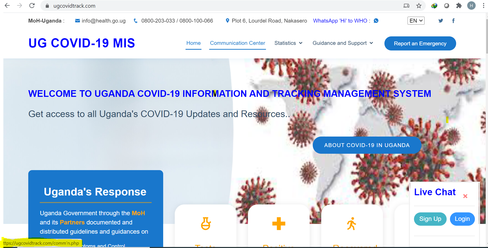
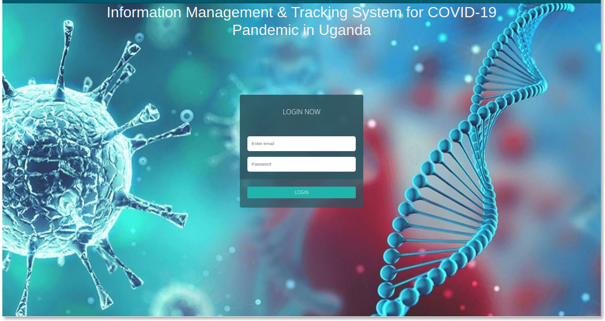
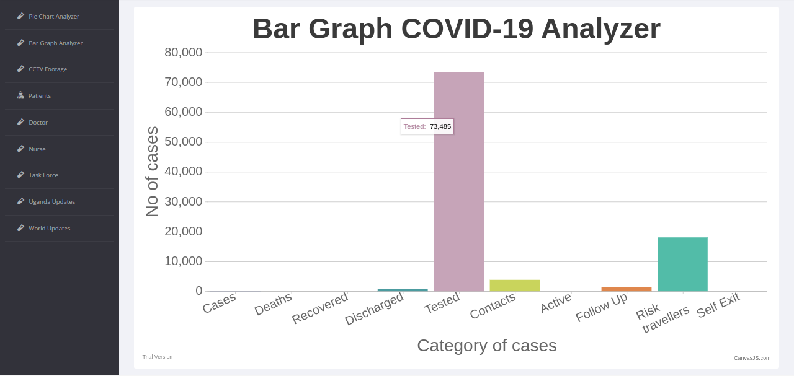
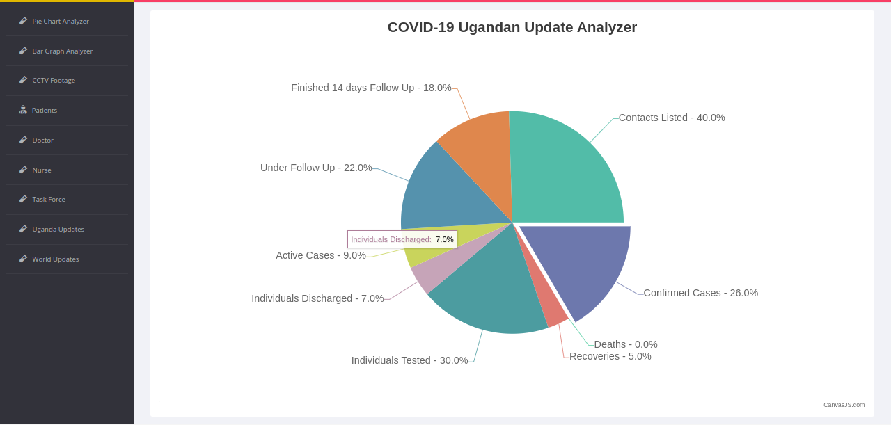
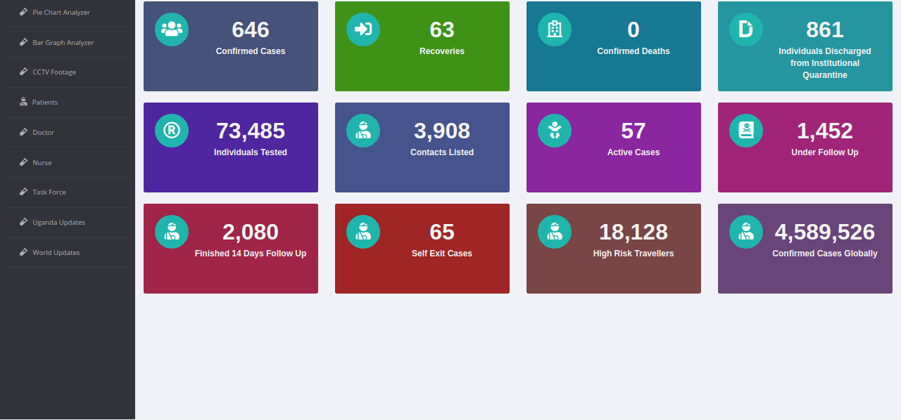
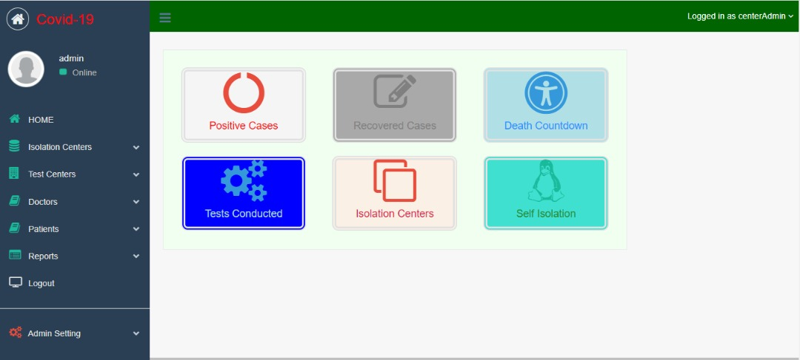

# 🦠 COVID-19 Information Management and Tracking System 

This project was developed to monitor, visualize, and support COVID-19 response efforts in Uganda. It includes case tracking, follow-up management, national and global analytics, and stakeholder coordination features like dashboards for doctors, nurses, patients, and task forces.

---
## ✅ Key Features

- Public dashboard with national COVID-19 statistics and updates
- Admin portal for authorized medical staff and institutions
- Reporting tools: case tracking, test center registration, isolation center logs
- Real-time data updates and chart analysis (pie and bar graphs)
- Role-based access for doctors, nurses, and administrators
- Communication tools (chat, emergency reporting, contact forms)

---

## 📸 Screenshots

### 🔹 Homepage – Public Information Portal  
Provides access to COVID-19 updates and Ministry of Health contacts  

Login page

---

### 🔹 Bar Graph COVID-19 Analyzer  
Visualizes test counts, case categories, and response metrics  

---

### 🔹 Pie Chart Uganda Updates  
Breakdown of follow-up status, active cases, testing, and outcomes  

---

### 🔹 National Dashboard – Stats Overview  
Summarizes all cases by category with real-time numbers  

---

### 🔹 Admin Portal – Center Management  
Used to manage test centers, isolation zones, and patient data  

---

## 🧰 Tools & Technologies

This project includes use of both backend and frontend development skills. Technologies and methods used include:

- **Languages:** PHP, JavaScript, HTML, CSS, SQL
- **Frameworks & Libraries:** CanvasJS (charts), Bootstrap
- **Database:** MySQL
- **Authentication:** Session-based login system for security
- **UX/UI:** Responsive layout design using HTML5/CSS3
- **Role-based Access:** Admin, Doctor, Nurse, Patient accounts
- **APIs:** Real-time API integration for global and national COVID-19 updates
- **Data Handling:** Form inputs, automated record classification
- **Basic DevOps:** Version tracking, environment setup, and deployment

## 📌 Conclusion

This project was developed with the support of **IEEE volunteers from Kyambogo University and Makerere University**, along with contributions from **Francis Ocwich** and **Alex Bazigu**. It was also funded by IEEE HAC/SIGHT 
